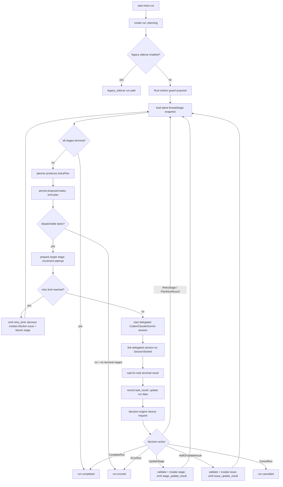

# Rust Native Astra + Pi ACP 重构实施方案

## 摘要

本次重构采用双轨迁移，目标是在不阻断现有能力的前提下，把 Astra 从“TS sidecar 负责策划/决策 + Rust 负责执行 + 私有 RPC 桥接”收敛为“Rust 单进程 orchestrator + 统一 ACP runtime + `pi_agent_rust` 作为 planner/decision backend”。

本方案按阶段实施，且允许在中期重构前端/Tauri API，不强制保持当前 `start_thread_astra` / `thread-astra-event` 形状不变。实施结束后，`sidecars/sessio-astra`、Astra 私有协议、`tool/call` 回调桥都将删除，只保留 Sessio Rust 与各 agent 的 ACP 交互。

## 目标架构

```text
Frontend
  -> Tauri commands/events
Rust Astra Orchestrator
  -> AstraPlanner trait
    -> DeterministicPlanner
    -> PiAcpPlanner
  -> AstraDecisionEngine trait
    -> DeterministicDecisionEngine
    -> PiAcpDecisionEngine
  -> RuntimeManager / AcpTransport
    -> pi_agent_rust (internal planning/decision session)
    -> codex / claude / gemini (delegated task sessions)
Store / Memory / Thread state
  -> Rust direct calls
```

## 关键接口与行为变更

- 新增 Rust 内部 `AstraPlanner` trait，planner 只负责根据 thread/stage snapshot 生成 `AstraPlan`，不负责 task dispatch 或直接 mutation。
- 新增 Rust 内部 `AstraDecisionEngine` trait，decision engine 负责根据 delegated task result、最新 snapshot、retry 状态生成 `AstraStageDecision` / `AstraIssueDecision` / retry / complete 等“请求型决策”，不直接写 store。
- 新增 Rust 内部 `AstraOrchestrator`，统一负责 run lifecycle、planning rounds、cancel、retry、task dispatch、result recording、决策校验与 stage/issue mutation 执行。
- Rust store 仍是 run、stage、issue、session linking 的唯一 durable owner；Pi 与 delegated agent 只能返回计划或决策请求。
- 规划器后端分为两种：
  - `DeterministicPlanner`：无 Pi 时的稳定 fallback。
  - `PiAcpPlanner`：通过内部 ACP backend 向 `pi_agent_rust` 发起短生命周期 planning session。
- 决策后端分为两种：
  - `DeterministicDecisionEngine`：保守更新，只在明确成功/失败信号下推进 stage 或创建 issue。
  - `PiAcpDecisionEngine`：通过内部 ACP backend 向 `pi_agent_rust` 发起短生命周期 decision session。
- `pi_agent_rust` 必须被建模为内部 ACP backend，而不是 Codex/Claude/Gemini 同类用户 agent；它不进入历史 agent enum，不出现在普通 chat runtime 列表，不参与 indexed session 语义。
- 前端/public API 允许收敛为更清晰的形状：
  - 保留“启动 run / 取消 run / 读取 runs / 订阅事件”四类能力。
  - 允许重命名命令和事件，但必须一次性完成迁移，不保留双命名长期兼容层。
- Astra 不再拥有独立 sidecar 协议；所有 agent 交互统一走 runtime layer。

## 新领域契约

Rust-native Astra 必须把“生成任务”“判断结果”“执行状态变更”拆成三个边界，避免把 sidecar 的隐式智能迁移成 Rust 内部黑盒。

### `AstraPlanner`

职责：

- 输入 run 元数据、thread/stage snapshot、user prompt、可选历史 task results、round index。
- 输出 `AstraPlan { summary, tasks[] }`。
- 不 dispatch task。
- 不写 store。
- 不声称 stage/issue 已变更。

输出约束：

- `tasks[].targetStageId` 必须解析到当前 thread stage，或为 `null` 表示 thread-level task。
- `tasks[].targetAgent` 必须是当前可委派 agent，且优先匹配 stage assistants。
- 单轮 task 数必须有上限，默认不超过 20。
- task id 由 Rust sanitize/normalize 后生成或去重，不能信任 planner 原始 id。

### `AstraDecisionEngine`

职责：

- 输入 latest snapshot、刚完成的 `AstraTaskResult`、stage attempt counts、retry limit、历史 decisions。
- 输出 `AstraDecision`：
  - `UpdateStage`
  - `AddOrUpdateIssue`
  - `RetryStage`
  - `PlanNextRound`
  - `CancelRun`
  - `CompleteRun`
  - `ErrorRun`
- 不直接写 store。
- 不绕过 retry limit。
- 不创建 delegated runtime session。

设计理由：

- 现有 sidecar 通过 `sessio.stage.update` / `sessio.stage.issue.add_or_update` 承担结果判断。如果迁移后只有 planner 产出 tasks，Rust orchestrator 会缺少“结果是否足以完成 stage”的语义来源。
- 因此 Phase 1 必须同时落地 deterministic decision engine，Phase 2 再把 Pi ACP decision engine 接入同一契约。

### `AstraOrchestrator`

职责：

- 是唯一 run lifecycle owner。
- 串行推进同一 run 的状态变更。
- 负责 active-run guard、round limit、retry limit、cancel token、timeout。
- 调用 planner 获取下一轮 task。
- 调用 runtime dispatch delegated task。
- 调用 decision engine 判断 task result。
- 校验 decision，再通过 store API 执行 stage/issue mutation。
- 在 delegated session 创建并拿到可持久化 agent/runtime session id 时立即记录 delegated session linking；terminal result 到达时只补 task result、attempt outcome、round history、terminal reason。
- `ErrorRun` 只终止当前 `runId`，将该 run 置为 `errored` 并释放 worker；不能停止其他 Astra run，也不能影响无关 delegated/user sessions。
- `CancelRun` 只终止当前 `runId`，将该 run 置为 `cancelled`；delegated task 被取消时不能混同为 stage completed 或普通 error。
- `needs_review` 是人工 review 暂停态；当没有可 dispatch task 且未完成 stage 都处于 `needs_review` 时，run 应以非错误 reason（如 `awaiting_review`）结束/暂停，不能落入 `errored`。

不允许：

- planner 或 decision engine 直接写 store。
- delegated agent 直接写 Astra run 状态。
- `pi_agent_rust` 直接 dispatch Codex/Claude/Gemini。
- 任意 backend 使用 shell/CLI 绕过 Rust store mutation。

### 内部 ACP backend

为 `pi_agent_rust` 增加独立内部 ACP backend 抽象，例如：

```text
InternalAcpBackendSessionSpec {
  purpose: Planning | Decision,
  command,
  workspacePath,
  model?,
  thinkingLevel?,
  timeoutMs,
  env,
  sessionDir?,
  metadata,
}
```

该抽象可以复用 `AcpTransport` 的协议实现，但不能复用普通 `StartAgentSession { agent: Agent }` 的公共语义。

必须满足：

- 不创建普通 chat session。
- 不写入 indexed historical agent session 表。
- 不触发普通 UI chat timeline。
- runtime events 必须带 `astraRunId`、`astraInternalPurpose`、`plannerBackend`，日志中与 delegated sessions 明确区分。
- session 结束后释放 controller、waiter、permission waiter 和 cancellation token。
- planner/decision session 的 transcript 若需要调试，只能作为 Astra run diagnostics 或 redacted log 保存，不进入 agent history。

## 状态、恢复与并发边界

- 每个 thread 同时最多一个 active Astra run；重复 start 必须返回现有 active run 或显式错误，不能创建第二个 active run。
- 每个 run 同时最多一个 orchestrator worker；进程内用 run-level lock / worker registry 防重入。
- app 启动时必须处理 active runs：
  - 如果没有可恢复 worker，则标记为 `interrupted`，并记录 terminal/interruption reason。
  - 不自动恢复 delegated tasks；恢复必须是后续显式能力。
  - 已存在 delegated sessions 只做 best-effort cleanup，不取消无 Astra metadata 的用户会话。
- cancel 必须覆盖 planning、decision、dispatch waiting、running 四个状态：
  - planning/decision 中：取消内部 ACP session。
  - dispatch waiting 中：取消对应 delegated turn 并释放 waiter。
  - running 中：只取消该 run 创建的 delegated sessions。
  - cancelled 后 late event 必须被忽略或只记录诊断，不能重新推进 run。
- timeout 必须分层：
  - planner timeout。
  - decision timeout。
  - delegated task timeout。
  - whole-run timeout 或 round limit。
- terminal 状态只允许一次写入；`completed`、`cancelled`、`errored`、`interrupted` 互斥。
- terminal run 收到 late dispatch error、late task result、late mutation request 时，不得覆盖既有 terminal 状态。
- stage/issue mutation 必须在 run-level write lock 下重新读取最新 run 并校验 active；不能基于 dispatch 返回前的旧 run snapshot 写 store。

## 权限、安全与配置边界

- `pi_agent_rust` planner/decision backend 默认不能请求项目文件写入权限，也不能 dispatch 外部 agent。
- 如果 ACP backend 发起 permission request，Astra 必须按 internal purpose 处理：
  - 默认 deny 未声明工具。
  - planning/decision 只允许读取型能力。
  - 任意写入型或 shell 型请求必须失败，并触发 deterministic fallback 或 run error。
- API key、provider config、base URL、env injection 必须 redaction 后进入日志和 diagnostics。
- planner command 必须来自配置白名单或用户明确配置；不能从 planner 输出反向决定 command。
- session dir/env injection 必须限定到 Astra internal session，不影响 delegated Codex/Claude/Gemini session。
- prompt 中的 memory/search 内容应有长度上限与敏感字段过滤；超长 snapshot 必须结构化裁剪，而不是简单无界拼接。
- deterministic fallback 不应掩盖安全拒绝：安全拒绝应记录为 policy failure；只有模型失败、非 JSON、超时、中断等可 fallback。

## 持久化与事件模型

建议为 `AstraRunRecord` 或其 JSON payload 补充字段：

- `plannerBackend`：`deterministic` / `pi_acp` / `sidecar_legacy`
- `decisionBackend`：`deterministic` / `pi_acp` / `sidecar_legacy`
- `roundIndex`
- `roundLimit`
- `terminalReason`
- `activeWorkerId` 或 last worker marker
- `internalPlannerSessionIds`
- `internalDecisionSessionIds`
- `lastErrorCode`
- `lastErrorMessage`
- `runDiagnostics`（redacted）

事件 payload 统一包含：

- `runId`
- `threadId`
- `status`
- `eventType`
- `timestamp`
- `data`

事件类型至少包括：

- `status`
- `plan`
- `decision`
- `task_dispatch`
- `task_result`
- `stage_update_result`
- `issue_update_result`
- `retry_limit`
- `cancelled`
- `error`
- `completed`
- `interrupted`

所有事件都必须可由当前 run record 重放或解释；前端不能依赖仅存在于旧 sidecar protocol 的 transient 字段。

## 迁移后 Astra Run 流程



关键顺序：

- run start 时固定 `mode`：`rust_native` 或 `legacy_sidecar`，run 中途不能混用。
- delegated session linking 在 delegated task session start、拿到可持久化 agent/runtime session id 时立即完成，不等 terminal result。
- late `SessionStarted` / real ACP session id ready 事件必须在 link 前重新确认 delegated state 未 finished 且 run 仍 active；cancelled/terminal run 只能忽略或诊断，不能再写 delegated link。
- task result 到达后先写 run task result，再由 decision engine 产出 mutation request。
- stage/issue 变更只能由 Rust orchestrator 在最新 active run 校验通过后执行。
- cancel Astra run 时只取消该 run 创建的 delegated sessions；Rust-native run 不调用 legacy sidecar cancel。
- delegated task cancel 进入 `CancelRun`，不会把 stage 标记 completed，也不会被误记为 `errored`。
- dispatch/start/send/waiter failure 在 run 仍 active 时将当前 run 置为 `errored`；若 run 已 terminal，不覆盖 terminal 状态。
- delegated `start_session` 成功但 `send_input` 失败时，必须 abort 该 delegated session 并移除 waiter，避免 runtime session / delegated state 泄漏。

## 阶段实施

### Phase 1：领域收口与 Rust Orchestrator 雏形

目标：把 Astra 的业务边界从 sidecar 收回 Rust，但先不依赖 Pi，并补齐 deterministic planning + deterministic decision 的闭环。

实施内容：

- 将当前 `src-tauri/src/astra/mod.rs` 拆分为较小模块，至少分出：
  - `types`：run/task/result/status 类型
  - `prompt`：stage task prompt / planning prompt 构造
  - `planner`：planner trait 与 deterministic planner
  - `decision`：decision engine trait 与 deterministic decision engine
  - `orchestrator`：run loop、dispatch、cancel、mutation
- 在 Rust 中定义 `AstraPlanner` trait：
  - 输入：run 元数据、thread snapshot、user prompt、可选历史 results
  - 输出：`AstraPlan`
- 在 Rust 中定义 `AstraDecisionEngine` trait：
  - 输入：run、最新 thread snapshot、task result、attempt counts、retry limit
  - 输出：`AstraDecision`
- 将 TS sidecar 中的 orchestration loop 迁移到 Rust：
  - round limit
  - terminal stage 判定
  - dispatchable task 过滤
  - retry limit 处理
  - task result 驱动的 decision
  - decision 校验后的 stage/issue 更新
- 把 current sidecar 中 deterministic planning 逻辑迁回 Rust，作为默认 planner。
- 增加 deterministic decision policy：
  - completed result 且输出包含明确完成信号时，可将 stage 标记 completed 或更新 summary/outcome。
  - completed result 但没有明确完成信号时，最多进入 `needs_review` / `blocked` / `PlanNextRound`，不能标记 completed。
  - `needs_review` stage 视为人工 review 暂停态，planner 不能继续直接 dispatch 同一 stage。
  - failed/errored result 默认创建/更新 issue 或保持 stage blocked。
  - cancelled result 触发 `CancelRun`，终止当前 run 为 `cancelled`，不能混同为 completed 或 errored。
  - retry limit reached 时必须创建/更新 blocker issue 或进入 `PlanNextRound`，不能继续直接重试。
  - 无明确判断时进入 `PlanNextRound` 或保守结束为 `errored`，不能伪造完成。
- 保留当前 sidecar 整条路径作为显式 legacy fallback，但不再是默认主路径。
- 增加 run-level worker registry，确保同一 run 只有一个 orchestrator worker。

交付标准：

- 新 orchestrator 可以在“不启用 Pi”的情况下完整跑完 planning -> dispatch -> decision -> mutation/complete。
- task dispatch、stage update、issue update、delegated session linking 与当前语义一致。
- delegated session linking 必须在 delegated task session start / agent session id 可持久化时完成，不能等 task terminal result 才 link。
- 旧 sidecar 路径仍可通过 feature flag 或 config 开关回退。
- app 重启后 active Rust-native runs 被标记 interrupted，不会 orphan。
- cancel 在 planning、decision、dispatch waiting、running 中都能释放 waiter 和 session。

退出标准：

- Rust deterministic orchestrator 在本地与测试环境可稳定运行。
- run 的创建、取消、完成、失败、重试上限都能被 Rust 直接管理。
- 不再依赖 `astra/start` 才能推进默认 run。

### Phase 2：接入 `PiAcpPlanner`

目标：用 `pi_agent_rust` ACP 替代 sidecar 中的 TS Pi SDK planner 和结果决策能力。

实施内容：

- 新增内部 ACP backend 抽象，复用 ACP protocol/transport，但不创建普通 user agent session。
- 新增 `PiAcpPlanner`，通过内部 ACP backend 创建独立 planning session。
- 新增 `PiAcpDecisionEngine`，通过内部 ACP backend 创建独立 decision session。
- planning/decision session 使用短生命周期策略：
  - 每次 planning/decision 新建 session
  - 结果返回后立即结束/释放
  - 不复用 task execution session
- 将现有 Astra planning prompt 从 TS 迁到 Rust，并固定输出契约：
  - 仅返回 JSON object
  - shape 为 `{ summary, tasks[] }`
  - task 字段齐全且 agent/stage 必须可校验
- 增加 decision prompt，并固定输出契约：
  - 仅返回 JSON object
  - shape 为 `{ action, stage?, issue?, retry?, summary?, reason }`
  - action 必须属于 `update_stage` / `add_or_update_issue` / `retry_stage` / `plan_next_round` / `complete_run` / `error_run`
  - stage/issue 字段必须可由 Rust 校验
- 在 Rust 中实现 planning result 处理：
  - 提取文本
  - JSON 修复/容错解析
  - 结构校验
  - sanitize 与 normalization
  - planner 失败时 fallback 到 deterministic planner
- 在 Rust 中实现 decision result 处理：
  - 提取文本
  - JSON 修复/容错解析
  - action 校验
  - stage/issue id 校验
  - retry limit guard
  - decision 失败时 fallback 到 deterministic decision engine
- 为 Pi planner 增加配置入口：
  - planner command / ACP command
  - model
  - thinking level
  - timeout
  - session dir/env injection
- 为 Pi decision engine 增加同源配置入口，可与 planner 共用 command/model，也可独立覆盖。
- 增加 redacted diagnostics，区分 planner failure、decision failure、policy denial、transport failure。

交付标准：

- 配置 `pi_agent_rust` 后，planning 与 decision 都可通过 ACP 完成。
- Pi 返回空结果、非 JSON、超时、取消、中断时，run 不崩溃，自动回退 deterministic planner/decision engine。
- planner 与 delegated task runtime 在日志和状态上能明确区分。
- internal ACP sessions 不出现在普通 chat UI 和 indexed historical sessions。
- 安全拒绝不会被误当作模型失败静默 fallback。

退出标准：

- 默认路径已经是 Rust orchestrator + Pi ACP planner/decision engine（当 Pi 已配置）。
- sidecar 只作为临时 fallback，不再承担主路径功能。

### Phase 3：替换前端/Tauri API 并移除 Astra 私有 RPC

目标：清理架构债，收敛成新的公开接口。

实施内容：

- 重新定义 Astra Tauri API，建议收敛为：
  - `create_astra_run`
  - `cancel_astra_run`
  - `list_astra_runs`
  - `get_astra_run`
- 重新定义事件流，建议收敛为单事件名，例如：
  - `astra-run-event`
- 前端统一改为新的 run/event 模型，不保留旧 Astra sidecar 协议痕迹。
- 迁移期间允许同一 PR 内短暂 adapter：
  - 新 API 与旧 API 可以同时存在于一个提交序列中。
  - 退出 Phase 3 前必须删除旧 command/event 引用。
  - 不发布长期双 API。
- 删除 Rust 中仅为 sidecar 服务的部分：
  - sidecar spawn
  - pending response map
  - `astra/start` / `astra/cancel` / `astra/task_result`
  - `tool/call` bridge
  - 私有协议 request/response/event 类型
  - sidecar disconnect recovery 逻辑

交付标准：

- 所有 Astra 操作只经过 Rust 内部 orchestrator。
- 前端不再依赖任何 sidecar 协议细节。
- Rust 中不存在 Astra 私有 RPC path。
- `src/api.ts` 与 UI hooks 只引用新 command/event。

退出标准：

- 从运行时角度，`sessio-astra` 已经不可达也不需要。
- 所有 run 都由 Rust 直接创建、推进、结束。

### Phase 4：删除 sidecar 与打包残留

目标：彻底删掉旧实现和分发残留。

实施内容：

- 删除 `sidecars/sessio-astra` 整个目录。
- 删除 Bun 相关构建脚本、smoke 脚本、lockfile。
- 删除 Tauri 配置中的 Astra sidecar binary 声明。
- 删除 capability 中对应的 sidecar command。
- 清理 README、开发文档、架构文档中关于 Astra sidecar 的描述。
- 更新测试和运维文档，只保留 Rust-native Astra 说明。
- 删除 legacy sidecar feature/config 开关。
- 删除 sidecar fallback 测试，只保留迁移前的历史说明或 changelog。

交付标准：

- 仓库、构建、打包、运行路径都不再包含 `sessio-astra`。
- 本地开发和发布产物不依赖 Bun sidecar。

退出标准：

- sidecar 完全删除后，应用功能不回退。
- 所有 CI / build / dev 文档与新架构一致。

## 迁移与兼容策略

- 采用双轨迁移：
  - Phase 1-2 期间保留旧 sidecar fallback。
  - fallback 通过显式 config/feature flag 开关，不自动隐式切换。
- 切换优先级：
  1. Rust orchestrator + Pi ACP planner/decision engine（当 Pi 配置完整且 policy 允许）
  2. Rust orchestrator + deterministic planner/decision engine（默认稳定 fallback）
  3. legacy sidecar fallback（仅迁移期，且必须显式开启）
- 当 Phase 3 完成时，关闭 fallback 并开始删除 sidecar 路径。
- 不保留长期双 API；一旦新前端 API 上线，旧命令和旧事件名直接清理。
- legacy sidecar fallback 是整条旧路径 fallback，不是 planner-only fallback；不能与 Rust-native orchestrator 混合写同一个 active run。
- 同一个 run 创建时必须固定 backend mode，run 中途不能从 Rust-native 切到 sidecar。

## 测试计划

必须覆盖以下场景：

### Planner 层

- deterministic planner 生成合法空/单任务/多任务计划
- Pi planner 正常返回合法 JSON 计划
- Pi planner 返回非 JSON / 缺字段 / 非法 agent / 非法 targetStageId
- Pi planner 超时、取消、ACP 中断
- Pi planner fallback deterministic planner

### Decision 层

- deterministic decision 对 completed/failed/errored/cancelled result 生成保守合法 decision
- Pi decision 正常返回合法 JSON decision
- Pi decision 返回非 JSON / 非法 action / 非法 stage id / 非法 issue payload
- Pi decision 请求 retry 但 retry limit 已达时被 Rust 拒绝
- Pi decision 请求 mutation inactive run 时被 Rust 拒绝
- Pi decision 超时、取消、ACP 中断时 fallback deterministic decision

### Orchestrator 层

- run 启动后进入 planning -> dispatching -> running -> completed
- 所有 actionable stages 已终结时直接完成
- 无 dispatchable tasks 时的错误收敛
- retry limit reached 时 issue 更新正确
- cancel 在 planning 中、dispatch 中、running 中都能正确结束
- cancel 在 decision 中能正确结束
- round limit reached 时 run 正确标记 errored
- 同一 thread 重复 start 不创建第二个 active run
- 同一 run 不启动第二个 worker
- late runtime event 不会推进 terminal run
- app 重启时 active run 被标记 interrupted

### Runtime / delegation

- delegated task session 创建、session linking、snapshot 保存
- delegated session start 后、terminal result 前，UI/store 已能看到 session link
- task result 成功/失败/取消/错误四种路径
- planner session 与 delegated task session 不串状态
- decision session 与 delegated task session 不串状态
- internal ACP session 不出现在普通 chat session 列表
- internal ACP backend / delegated ACP agent 断开后 run 正确失败或回退
- permission request 在 planning/decision session 中按 policy allow/deny
- API key/env/config 日志脱敏

### Frontend / API

- 新 command 与事件流能驱动现有 UI
- run 列表、详情、事件订阅、取消操作正常
- event payload 与 TS types 一致
- 不再引用旧 `thread-astra-event` 或 sidecar 特定字段
- 新旧 API adapter 在 Phase 3 结束前全部删除
- terminal/interrupted/error reason 能在 UI 中显示或至少可诊断

### Build / packaging

- 无 `sessio-astra` binary 时开发构建正常
- release bundle 不包含 Astra sidecar
- capability / tauri config 清理后运行无权限错误

## 里程碑与验收

- M1：Rust deterministic orchestrator 上线，旧 sidecar 可回退
- M2：`PiAcpPlanner` + `PiAcpDecisionEngine` 上线，并在 Pi 配置完整时作为默认智能 backend
- M3：前端切到新 Astra API / event model
- M4：sidecar、私有 RPC、打包残留全部删除

每个里程碑都必须满足：

- 集成测试通过
- 无 orphaned run / stuck run
- delegated session linking 不回退
- thread/stage mutation 语义保持稳定
- planner/decision/backend mode 可诊断
- 安全、权限、日志脱敏检查通过

## 假设与默认决策

- 采用双轨迁移，而不是一次性切换。
- 允许重构前端/Tauri API，不要求保留旧命令和事件名。
- `pi_agent_rust` 仅作为 planner/decision backend，不承担 Astra orchestrator 语义。
- planner/decision session 采用短生命周期策略，不做长期复用。
- deterministic planner/decision engine 始终保留，作为 Pi backend 失败时的稳定 fallback。
- Astra run 的持久化与 stage/session linking 继续保留在 Rust store 层，不迁移到 agent 侧。
- `pi_agent_rust` 不加入普通 user agent enum，不进入 historical indexing。
- 自动恢复 interrupted run 不属于本迁移范围；本迁移只保证中断可见、可诊断、无 orphan。
