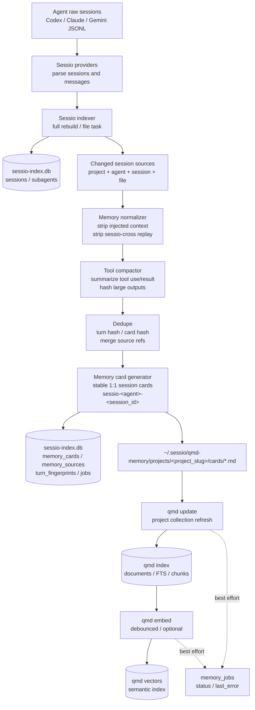
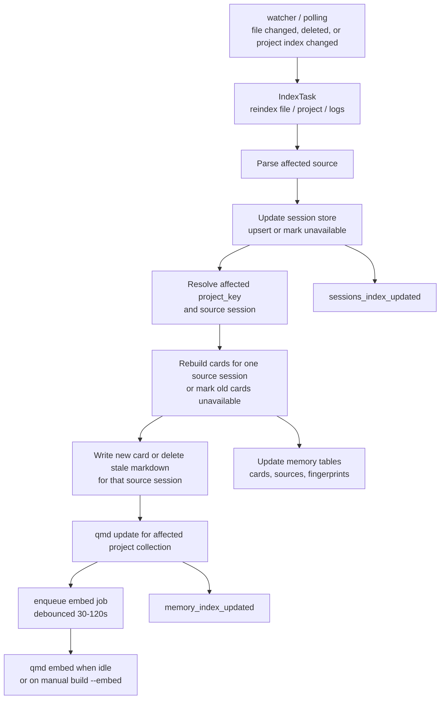
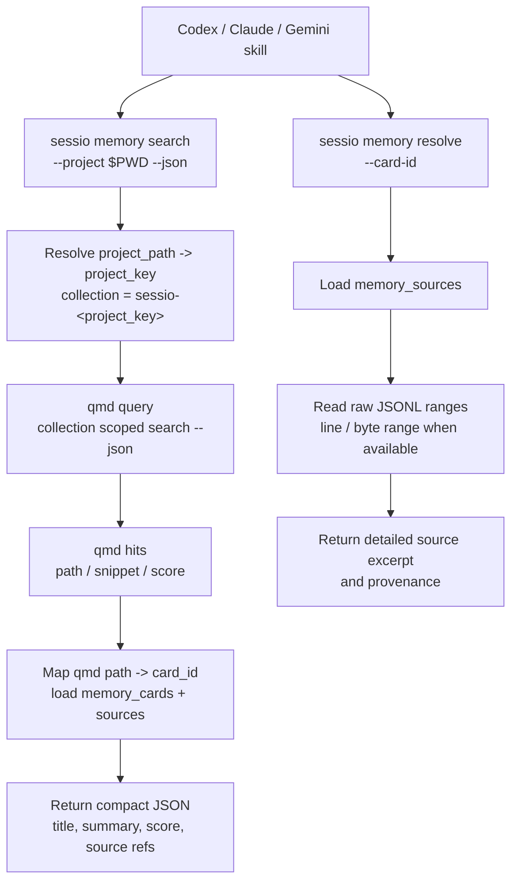

# Sessio CLI 与 qmd 项目记忆方案

## Summary

Sessio 下一阶段目标是把桌面应用背后的会话索引、消息提取、项目记忆和检索能力 CLI 化，让 Codex、Claude、Gemini 等 agent 可以通过 skill 调用 Sessio，检索当前 project 的历史 session 信息。

核心设计：

- Sessio 继续作为 agent session 的统一解析层和事实源索引层
- qmd 只作为项目级压缩记忆的检索后端，不直接保存完整 JSONL
- CLI 提供稳定 JSON API，skill 只调用 CLI，不直接理解 qmd 或各 agent JSONL 格式
- build index 全量重建时同步生成 qmd 所需 memory 数据
- polling / watcher 增量更新 session 时同步更新对应 memory cards 和 qmd 索引
- qmd 命中后返回 memory card，详情通过 Sessio 回源原始 JSONL

目标不是把所有对话原文塞进 qmd，而是生成小而准的 project memory cards。qmd 负责“找到相关记忆”，Sessio 负责“维护来源、去重、压缩和回源详情”。

## Architecture

整体数据流：

```text
Codex / Claude / Gemini JSONL
  ↓
providers
  ↓
indexer
  ├─ sessions / subagents metadata -> sessio-index.db
  └─ changed session events
       ↓
memory pipeline
  ├─ normalize messages
  ├─ strip sessio-cross replay blocks
  ├─ compact tool use / tool result
  ├─ dedupe turns and cards
  ├─ write project memory cards
  └─ update qmd collection
       ↓
skill / CLI search
  ↓
qmd query
  ↓
Sessio resolves card source refs back to raw JSONL
```

推荐目录：

```text
~/.sessio/
  db-data/
    sessio-index.db
  qmd-memory/
    projects/
      <project_slug>/
        cards/
          <card_id>.md
        manifest.json
```

qmd 自己的 SQLite index 仍由 qmd 管理，可以使用 qmd 默认目录，也可以后续通过配置指定到 Sessio data dir。Sessio 不应直接写 qmd 内部表结构。

## Layering And Extensibility

为了后续添加新的 agent provider，Sessio 应把 provider、indexer、memory、qmd、CLI 做成清晰分层。除 provider 层外，其他层不应该关心 Codex / Claude / Gemini 的原始文件格式。

建议分层：

```text
agent provider layer
  只负责识别和解析各 agent 的磁盘格式
  输出统一 SessionRecord / MessageEvent / SourceRef

indexer layer
  只处理统一数据结构
  负责 full rebuild、watcher/polling task、增量失效

store layer
  持久化统一 session metadata、source metadata、memory metadata

memory layer
  基于统一 MessageEvent 生成 cards
  负责 cross prompt 去重、tool 压缩、turn/card dedupe

qmd backend layer
  只接收 card files 和 project collection
  不理解 agent 格式

CLI / skill layer
  只暴露稳定 JSON API
  不暴露内部 provider 差异
```

依赖方向必须单向：

```text
CLI/UI -> indexer/store/memory -> providers
memory -> qmd backend
qmd backend 不反向依赖 providers/store 之外的 agent 细节
```

### Agent Provider Interface

每个 agent provider 应实现同一个 trait。新增 agent 时只需要实现 provider 和 watch path 规则，不改 memory/qmd/CLI。

建议接口：

```rust
trait AgentProvider: Send + Sync {
    fn agent(&self) -> AgentKind;
    fn display_name(&self) -> &'static str;

    fn roots(&self) -> Result<Vec<WatchRoot>>;
    fn discover(&self) -> Result<Vec<SessionSource>>;
    fn parse_source(&self, source: &SessionSource) -> Result<ParsedSession>;
    fn read_messages(&self, source: &SessionSource) -> Result<Vec<MessageEvent>>;

    fn classify_path_event(&self, event: &PathEvent) -> Option<ProviderTask>;
}
```

统一 task：

```rust
enum ProviderTask {
    ReindexSource(SessionSource),
    ReindexScope(SourceScope),
    MarkSourceUnavailable(SessionSource),
    RefreshProjectMappings,
}
```

统一 watch root：

```rust
struct WatchRoot {
    agent: AgentKind,
    path: PathBuf,
    recursive: bool,
    purpose: WatchPurpose,
}
```

这样 watcher/polling 只负责收集文件事件并询问 provider 如何分类，不把 Claude / Gemini 的路径规则写死在上层。

### Unified Data Model

建议把现有 `Agent` 扩展为可注册的 `AgentKind`。第一版可以仍用 enum，后续如果要支持外部插件或动态 provider，再迁移到 string id。

```rust
#[derive(Debug, Clone, PartialEq, Eq, Hash, Serialize, Deserialize)]
struct AgentKind(String);

struct SessionSource {
    agent: AgentKind,
    session_id: String,
    scope: String,
    file_path: PathBuf,
    project: Option<ProjectRef>,
    source_kind: SourceKind,
}

struct ProjectRef {
    project_key: String,
    project_path: Option<PathBuf>,
    project_name: Option<String>,
}

enum SourceKind {
    MainSession,
    Subagent,
    ProjectIndex,
    Logs,
    Archive,
}
```

provider 输出的 session 元数据：

```rust
struct SessionRecord {
    source: SessionSource,
    started_at: Option<i64>,
    updated_at: Option<i64>,
    message_count: usize,
    first_user_message: Option<String>,
    file_size: u64,
    file_mtime: Option<i64>,
    partial: bool,
    available: bool,
    archived: bool,
    children: Vec<SessionChildRecord>,
}
```

统一消息事件：

```rust
struct MessageEvent {
    source: SessionSource,
    event_id: Option<String>,
    turn_index: usize,
    role: MessageRole,
    content: MessageContent,
    timestamp: Option<i64>,
    location: SourceLocation,
}

enum MessageRole {
    User,
    Assistant,
    Thinking,
    System,
    ToolUse,
    ToolResult,
    Unknown(String),
}

enum MessageContent {
    Text(String),
    ToolUse(ToolUseEvent),
    ToolResult(ToolResultEvent),
    Mixed(Vec<MessageContentPart>),
}

struct SourceLocation {
    file_path: PathBuf,
    line_start: Option<u64>,
    line_end: Option<u64>,
    byte_start: Option<u64>,
    byte_end: Option<u64>,
}
```

memory pipeline 只接收 `MessageEvent`，因此新增 agent 的 tool 格式、消息格式都在 provider 内部归一化。

### Store Interfaces

数据层应拆成三个逻辑 store，但可以先共用同一个 SQLite 文件和同一个 rusqlite connection。

```rust
trait SessionStore {
    fn init(&self) -> Result<()>;
    fn list_sessions(&self, filter: SessionFilter) -> Result<Vec<SessionRecord>>;
    fn list_sources(&self, filter: SourceFilter) -> Result<Vec<SessionSource>>;
    fn upsert_session(&self, record: &SessionRecord) -> Result<()>;
    fn replace_scope(&self, scope: &SourceScope, records: &[SessionRecord]) -> Result<()>;
    fn mark_source_unavailable(&self, source: &SessionSource) -> Result<()>;
}

trait MessageSourceStore {
    fn upsert_message_locations(&self, source: &SessionSource, events: &[MessageEvent]) -> Result<()>;
    fn resolve_source_range(&self, source: &SessionSource, range: SourceLocation) -> Result<RawExcerpt>;
}

trait MemoryStore {
    fn init(&self) -> Result<()>;
    fn replace_source_cards(&self, source: &SessionSource, cards: &[MemoryCard]) -> Result<()>;
    fn mark_source_cards_unavailable(&self, source: &SessionSource) -> Result<()>;
    fn list_project_cards(&self, project_key: &str) -> Result<Vec<MemoryCard>>;
    fn sources_for_card(&self, card_id: &str) -> Result<Vec<MemorySource>>;
}
```

`SessionStore` 负责列表和增量索引，`MessageSourceStore` 负责详情回源定位，`MemoryStore` 负责 card 和 qmd 映射。这样后续换 DB 或加远程同步时，不会影响 provider。

### Provider Registry

建议新增 registry，集中管理可用 provider：

```rust
struct ProviderRegistry {
    providers: Vec<Box<dyn AgentProvider>>,
}

impl ProviderRegistry {
    fn discover_all(&self) -> Result<Vec<SessionSource>>;
    fn provider_for_agent(&self, agent: &AgentKind) -> Option<&dyn AgentProvider>;
    fn classify_path_event(&self, event: &PathEvent) -> Vec<ProviderTask>;
    fn watch_roots(&self) -> Result<Vec<WatchRoot>>;
}
```

当前内置 provider：

```text
codex provider
claude provider
gemini provider
```

未来新增 provider 时：

1. 新增 `src-tauri/src/providers/<agent>/parser.rs`
2. 实现 `AgentProvider`
3. 注册到 `ProviderRegistry`
4. 增加 parser 测试和 sample fixtures
5. 不修改 memory/qmd/CLI 的核心逻辑

### Data Boundary Rules

必须保持以下边界：

- provider 可以知道 agent 原始格式
- indexer 不可以解析 JSONL 内容，只调 provider
- memory 不可以读取 agent 特有 JSON 字段，只处理 `MessageEvent`
- qmd backend 不可以读取原始 session 文件，只处理 card files
- CLI 不可以暴露 agent 特有字段，除非放在 `metadata` map 中
- skill 不可以依赖 qmd 或 JSONL 格式，只依赖 CLI JSON

如需保留 agent 特有信息，统一放进 metadata：

```rust
type Metadata = BTreeMap<String, serde_json::Value>;
```

但核心流程不应依赖 metadata 中的字段。

## Data Flow Diagram

### Index And Memory Build



### Incremental Sync



### Search And Resolve



## CLI Goals

CLI 是给 skill 和其他 agent 用的稳定接口。第一版命令建议放在 Tauri crate 的 Rust binary 中，例如：

```text
src-tauri/src/bin/sessio.rs
```

CLI 复用现有 `app_lib::providers`、`store`、`indexer` 模块。后续如果 GUI 和 CLI 共享逻辑变多，可以抽出 `core` 模块。

已实现命令：

```bash
sessio sessions list --project /path/to/project --json
sessio sessions messages --agent codex --session-id <id> --file-path <path> --json

sessio memory build --project /path/to/project --json
sessio memory search --project /path/to/project "query text" --json
sessio memory search --project-key <project_slug> "query text" --json
sessio memory resolve --card-id <card_id> --json
sessio memory jobs --project-key <project_slug> --json

sessio qmd status --json
sessio qmd sync --project-key <project_slug> --cards-root <path> --json
sessio qmd sync --project-key <project_slug> --cards-root <path> --embed --json
```

Skill 主入口应该尽量简单：

```bash
sessio memory search --project "$PWD" "之前怎么设计 qmd 存储？" --json
```

返回示例：

```json
{
  "query": "之前怎么设计 qmd 存储？",
  "projectKey": "-Users-alex-Work-cloudgeek-sessio",
  "collection": "sessio--Users-alex-Work-cloudgeek-sessio",
  "backendError": null,
  "hits": [
    {
      "cardId": "sessio-codex-abc123",
      "title": "Project-level qmd memory design",
      "summary": "Use qmd for compressed project memory cards while Sessio keeps raw JSONL source mappings.",
      "qmdPath": "-Users-alex-Work-cloudgeek-sessio/cards/sessio-codex-abc123.md",
      "score": 0.82,
      "snippet": null,
      "sources": [
        {
          "cardId": "sessio-codex-abc123",
          "agent": "codex",
          "sessionId": "abc123",
          "filePath": "/Users/alex/.codex/sessions/...",
          "location": {
            "filePath": "/Users/alex/.codex/sessions/...",
            "lineStart": null,
            "lineEnd": null,
            "byteStart": null,
            "byteEnd": null
          }
        }
      ]
    }
  ]
}
```

默认输出 **不** 包含 qmd 内部 payload。需要调试 qmd 返回结构时加 `--include-raw`，响应会多一个 `raw` 字段携带 qmd 原始 JSON。Skill 不应在正常工作流中使用该字段。

当 qmd 不可用、损坏或超时时，`memory search --json` 返回 `hits: []` 和非空 `backendError`。skill 应把这视为“本次没有可用 Sessio memory 命中”，不要猜测历史上下文。

## Skill Design

创建一个 Sessio skill，让其他 agent 用自然语言检索当前 project 的历史 session 数据。

Skill 职责：

- 判断当前工作目录对应的 project
- 调用 `sessio memory search --project "$PWD" <query> --json`
- 将命中的 card summary 和 source refs 提供给 agent
- 当 agent 需要详情时，再调用 `sessio memory resolve --card-id <card_id> --json`
- 不直接读取 JSONL
- 不直接调用 qmd
- 不直接解析 qmd 输出

Skill 说明里应强调：

- search 返回的是压缩记忆，不是完整事实
- resolve 才会读取原始 JSONL 片段
- 如果没有命中，agent 应该说明未找到历史记忆，而不是猜测

## Session Processing

### Normalization

Session 处理管线应复用现有 providers，但需要比 UI 展示多保留来源定位信息。

建议新增内部结构：

```rust
struct RawTurn {
    agent: Agent,
    session_id: String,
    file_path: String,
    role: String,
    text: String,
    timestamp: Option<i64>,
    line_start: Option<u64>,
    line_end: Option<u64>,
    byte_start: Option<u64>,
    byte_end: Option<u64>,
}
```

**v1 status**: 来源定位采用混合粒度。Codex 和 Claude 的 `read_messages_with_locations` 会为每条消息记录 `line_start/line_end/byte_start/byte_end`；card 级 `memory_sources` 取所有 events 的并集 (min line_start ..= max line_end，byte 同理)。Gemini 的 `logs.json` 是单个 JSON Array，`serde_json::from_str` 不暴露每个 element 的 byte offset，因此 Gemini 暂时仍是 session 级（全 None），等流式 JSON 扫描器到位再补 — 见 `docs/sessio-cli-qmd-memory-todos.md` 的 v2 roadmap。`memory resolve --include-source-excerpt` 会基于 location 把原始 JSONL 范围回读出来。

### Cross Prompt 去重

Sessio 已经给 cross prompt 增加机器可读边界：

```md
<!-- sessio-cross:start source_agent="codex" source_session_id="..." source_file_path="..." -->

# Continued session from agent
The dialogue below is the recent context of an in-progress session ...

<!-- sessio-cross:end -->
```

memory pipeline 必须在索引前删除 `sessio-cross:start` 到 `sessio-cross:end` 之间的 replay block。这个 block 不是目标 session 的新信息，只是 continuation 上下文。

如果用户在同一条消息里追加了新需求，后续格式应尽量让新需求放在 end marker 之后。pipeline 只删除 marker 包住的部分，保留 end 之后的真实新需求。

同时记录 session 关系：

```sql
session_links(
  target_agent TEXT NOT NULL,
  target_session_id TEXT NOT NULL,
  source_agent TEXT,
  source_session_id TEXT,
  source_file_path TEXT,
  link_type TEXT NOT NULL,
  created_at INTEGER NOT NULL
)
```

### Tool Use / Tool Result

qmd memory 不应保存完整 tool output。建议规则：

- `tool_use`
  - 保留 tool name、command、cwd、关键参数
  - 提取涉及文件路径
  - 提取测试命令、构建命令、git 命令等重要动作
- `tool_result`
  - 保留 exit code、成功/失败状态
  - 保留错误摘要、关键测试名、关键文件行号
  - 保留输出 hash 和 source line range
  - 不保存完整 stdout / stderr
- 大输出
  - 生成 digest，例如 “cargo test failed: E0425 in src/foo.rs:42”
  - 详情通过 `memory resolve` 回源 JSONL

### Card Generation

不要一条 session 一个 Markdown，也不要一条 message 一个 Markdown。推荐：

当前实现是更保守的第一版：

```text
1 card = 1 session source
card_id = sessio-<agent>-<session_id>
project folder = <project_slug derived from canonical project path>
```

后续如果要把单 session 再细分成多个 task/decision cards，可以在保持 source ref 抽象不变的前提下扩展。

card 内容应面向检索，包含：

- title
- summary
- decisions
- files touched
- commands / tests summary
- unresolved questions
- source refs
- keywords

示例：

```md
---
card_id: sessio-codex-abc123
project_key: -Users-alex-Work-cloudgeek-sessio
project_path: /Users/alex/Work/cloudgeek/sessio
agent: codex
session_id: abc123
source_jsonl: /Users/alex/.codex/sessions/...
line_start: 120
line_end: 186
kind: design
keywords:
  - qmd
  - project memory
  - session dedupe
---

# Project-level qmd memory design

Summary:
Use qmd as a project-level compressed memory search backend. Sessio remains responsible for session metadata, source mappings, dedupe, and resolving raw JSONL details.

Decisions:
- Do not store full JSONL content in qmd.
- Strip sessio-cross replay blocks before memory generation.
- Store compact tool summaries instead of full stdout/stderr.

Sources:
- codex abc123 lines 120-186
```

## Deduplication

qmd can help avoid exact duplicate document content, but Sessio must own real dedupe. Cross-agent continuation creates partial and near duplicates that qmd cannot reliably remove.

### v1 (implemented)

- card-level stable id: `sessio-<agent>-<session_id>` (1 card per session source)
- `memory_cards.canonical_hash`: SHA-256 over normalized title/summary/body for change detection
- **turn content hash** (`turn_content_hash`): SHA-256 over `role + canonical_text(content)` **only**. Intentionally excludes agent / session_id / turn_index so two turns with the same normalized content collide across sessions (and across agents during cross-agent continuation). This is what gets stored in `turn_fingerprints.canonical_hash`.
- **turn source location** is preserved separately through the `turn_fingerprints` primary key `(project_key, agent, session_id, turn_index)` plus the `file_path / line_start / line_end / byte_start / byte_end` columns — these answer "where did this turn come from", not "what does it say".
- per-turn fingerprints are written during card build (`build_project_memory` and `build_source_memory`), and cleared (`replace_turn_fingerprints(..., &[])`) whenever a source no longer produces cards
- stale cards marked `available = 0` and their markdown removed when the source no longer produces them

### v2 (planned)

- tool result digest hash: hash command, exit code, key errors, output hash
- near-duplicate detection across cards: SimHash / MinHash over card text; merge similar cards by appending source refs instead of creating a new qmd card. `memory_cards.simhash` column is reserved for this; v1 leaves it `NULL`.
- using `turn_fingerprints` to actively suppress card generation for sessions whose turns are fully covered by an existing card (continuation dedupe), instead of relying purely on stable card id collision

Suggested tables (v1 schema, v2 fields reserved):

```sql
memory_cards(
  card_id TEXT PRIMARY KEY,
  project_key TEXT NOT NULL,
  canonical_hash TEXT NOT NULL,
  simhash TEXT,
  qmd_path TEXT NOT NULL,
  title TEXT NOT NULL,
  summary TEXT,
  available INTEGER NOT NULL DEFAULT 1,
  updated_at INTEGER NOT NULL
);

memory_sources(
  card_id TEXT NOT NULL,
  agent TEXT NOT NULL,
  session_id TEXT NOT NULL,
  file_path TEXT NOT NULL,
  line_start INTEGER,
  line_end INTEGER,
  byte_start INTEGER,
  byte_end INTEGER,
  PRIMARY KEY(card_id, agent, session_id, file_path, line_start, line_end)
);

turn_fingerprints(
  project_key TEXT NOT NULL,
  agent TEXT NOT NULL,
  session_id TEXT NOT NULL,
  turn_index INTEGER NOT NULL,
  role TEXT NOT NULL,
  canonical_hash TEXT NOT NULL,
  line_start INTEGER,
  line_end INTEGER,
  PRIMARY KEY(project_key, agent, session_id, turn_index)
);
```

## qmd Integration

qmd 作为外部检索后端接入。第一版不要把 qmd SDK 或 native dependencies 直接打包进 Tauri。

阶段建议：

1. 外部 qmd CLI
   - 检测 `qmd` 是否可用
   - 不可用时提示安装
   - Sessio 通过 CLI 调 `collection add`、`update`、`embed`、`query --json`
2. 托管 sidecar
   - Sessio 启动 qmd MCP / HTTP daemon
   - 减少查询冷启动成本
3. 内置分发
   - 打包 Node runtime、qmd、native sqlite/vector/llama 依赖
   - 最产品化，但跨平台成本最高

每个 project 推荐一个 qmd collection：

```bash
qmd --index sessio collection add ~/.sessio/qmd-memory/projects/<project_slug> \
  --name sessio-<project_slug> \
  --mask "**/*.md"

qmd --index sessio update
qmd --index sessio embed
qmd --index sessio search "query text" -c sessio-<project_slug> --json
```

Sessio 侧要维护：

- project path -> project slug
- project slug -> qmd collection name
- qmd binary path
- qmd index name or db path
- last qmd update/embed status
- last error

## Index Build And Polling Sync

这是实现时最重要的边界：**session index 更新和 qmd memory 数据更新必须在同一条索引流水线里触发**。

### Full Rebuild

`IndexTask::FullRebuild` 流程建议：

1. 扫描 Codex / Claude / Gemini 原始 session 文件
2. 更新 `sessions` 和 `subagents`
3. 收集本次 rebuild 中所有受影响 project
4. 对每个 project 运行 memory rebuild
   - 重新扫描该 project 下的全部 session sources
   - 重新生成稳定 session cards
   - 更新 `memory_cards` / `memory_sources` / `turn_fingerprints`
   - 写入 `~/.sessio/qmd-memory/projects/<project_slug>/cards/*.md`
   - 对本次未再出现的旧 source cards 标记 unavailable 并删除对应 markdown
5. 对每个受影响 project 调 qmd update
6. 按配置决定是否立即调 qmd embed
7. 发出 `sessions_index_updated` 和可选 `memory_index_updated`

首次实现可以把 qmd 同步作为 best-effort：session DB 写入成功是主路径，qmd 失败只记录错误，不回滚 session index。

### Incremental Watcher / Polling

当 watcher 或 polling 发现某个 session 文件变化：

1. 解析变化文件
2. 更新 `sessions` / `subagents`
3. 识别 affected project
4. 只重建该 session 对应的 memory cards
   - 复用稳定 card id `sessio-<agent>-<session_id>`
   - 仅更新该 source 对应的 `memory_cards` / `memory_sources`
   - 若该 session 不再能生成可用 memory，则把旧 card 标记 unavailable 并删除 markdown
5. 写新 Markdown card，或删除该 session 旧 Markdown card
6. 对 affected project 调 qmd update
   - 当前仍是 qmd index 级 `update`
   - 不是单 card 直写 qmd
7. 根据策略延迟 embed

建议不要每次小变更都同步跑 expensive embedding：

- `qmd update` 可以更频繁执行，但当前粒度仍是整个 index / collection 刷新
- `qmd embed` 做防抖批处理，例如 30-120 秒
- 用户主动 search 前，如果检测到 project 有 pending embeddings，可以先提示或后台补齐
- 可提供 `sessio memory build --embed` 手动强制生成向量

### Failure Handling

qmd 同步失败不能破坏 Sessio 主索引：

- session index 写入成功后立即可用
- memory card 写入失败记录到 `memory_jobs`
- qmd update/embed 失败记录 last_error
- 下一次 polling 或手动 `sessio memory update` 可重试

建议表：

```sql
memory_jobs(
  id INTEGER PRIMARY KEY AUTOINCREMENT,
  project_key TEXT NOT NULL,
  scope TEXT NOT NULL,
  kind TEXT NOT NULL,
  status TEXT NOT NULL,
  error TEXT,
  created_at INTEGER NOT NULL,
  updated_at INTEGER NOT NULL
);
```

## Public Rust Interfaces

建议新增模块：

```text
src-tauri/src/cli/
src-tauri/src/memory/
src-tauri/src/memory/cards.rs
src-tauri/src/memory/dedupe.rs
src-tauri/src/memory/qmd.rs
src-tauri/src/memory/store.rs
src-tauri/src/bin/sessio.rs
```

建议内部接口：

```rust
trait MemoryStore {
    fn upsert_card(&self, card: &MemoryCard) -> Result<()>;
    fn replace_card_sources(&self, card_id: &str, sources: &[MemorySource]) -> Result<()>;
    fn list_cards_for_source(&self, agent: &str, session_id: &str, file_path: &str) -> Result<Vec<MemoryCard>>;
    fn mark_card_unavailable(&self, card_id: &str) -> Result<()>;
    fn mark_source_cards_unavailable(&self, agent: &str, session_id: &str, file_path: &str) -> Result<()>;
    fn list_project_cards(&self, project_key: &str) -> Result<Vec<MemoryCard>>;
}

trait QmdBackend {
    fn ensure_collection(&self, project: &ProjectRef) -> Result<()>;
    fn update_project(&self, project: &ProjectRef) -> Result<()>;
    fn embed_project(&self, project: &ProjectRef) -> Result<()>;
    fn search_project(&self, project: &ProjectRef, query: &str) -> Result<Vec<QmdHit>>;
}
```

Indexer 侧建议新增 hook：

```rust
trait MemoryIndexer {
    fn rebuild_all(&self) -> Result<()>;
    fn rebuild_project(&self, project: &ProjectRef) -> Result<()>;
    fn rebuild_session(&self, session: &SessionInfo) -> Result<()>;
    fn mark_source_unavailable(&self, file_path: &str) -> Result<()>;
}
```

## Implementation Phases

### Phase 1: CLI Read APIs

- 新增 `sessio` Rust binary
- 实现 `sessions list --json`
- 实现 `sessions messages --json`
- 输出稳定 JSON
- 为 skill 预留退出码和错误格式

### Phase 2: Memory Card Pipeline

- 新增 memory tables
- 从现有 providers 生成 normalized turns
- 删除 `sessio-cross` replay block
- 压缩 tool use / tool result
- 生成 project memory cards
- 写入 Markdown card files
- 支持 `sessio memory build --project`

### Phase 3: qmd CLI Backend

- 检测 qmd binary
- ensure collection
- update project collection
- query project collection
- `sessio memory search --json`
- `sessio memory resolve --json`

### Phase 4: Indexer Integration

- `FullRebuild` 完成 session DB 更新后触发 memory rebuild
- watcher 增量任务完成后触发 session-level memory rebuild
- polling 检测到文件变化后同步更新 memory cards
- qmd update 做 best-effort
- qmd embed 做防抖批处理

### Phase 5: Skill

- 创建 Sessio skill
- skill 调用 `sessio memory search`
- 需要详情时调用 `sessio memory resolve`
- 增加“未命中不要猜测”的指引

## Test Plan

### CLI

- `sessio sessions list --json` 输出合法 JSON
- `sessio sessions messages --json` 能读取 Codex / Claude / Gemini
- project path 不存在时返回结构化错误
- qmd 不存在时 `sessio qmd status --json` 返回可读错误
- qmd query 超时时 `sessio memory search --json` 返回空 hits 和 `backendError`

### Memory

- cross prompt marker 内的 replay block 不进入 card
- tool result 大输出被压缩为摘要和 hash
- 同一 turn 重复出现在 continuation 中不会生成重复 card
- 同一 card 被多个 session source 引用时能合并 source refs
- 删除 session 文件后相关 cards 被标记 unavailable

### qmd

- memory build 后 qmd collection 能创建
- qmd query 返回 card path / score / snippet
- `memory search` 能把 qmd hit 映射回 `card_id`
- `memory resolve` 返回 card metadata/body 和 source refs；原始 JSONL 精确范围可后续增强

### Indexer / Polling

- 全量 rebuild 后同步生成 qmd memory cards
- 单个 Codex JSONL 更新后只重建对应 session card，并删除该 session 的 stale markdown
- Claude project 重扫后对应 project qmd collection 更新
- Gemini logs.json 变化后对应 project cards 更新
- qmd update 失败不影响 session index
- qmd embed 防抖不会阻塞频繁 polling

## Open Questions

- 第一版是否先不做 LLM summary，只做规则压缩和 extractive cards？
- qmd embedding 是否默认关闭，等用户显式启用后再下载模型？
- memory card 的 project key 当前已经改为 canonical project path 派生的可读 slug，而不是 hash 或 agent 自带 id。
- line / byte offset 是否第一版就必须实现，还是先 session 级 source refs？
- qmd collection 是每个 project 一个，还是一个 collection + metadata filter？当前建议每 project 一个 collection，便于 skill 限定搜索范围。

## Recommended Defaults

- 默认生成 memory cards，但默认不自动下载 embedding 模型
- 默认 qmd update best-effort，不阻塞 session index
- 默认 `memory search` 使用 qmd BM25 / hybrid 可用能力
- 默认只保存压缩 card，不保存完整 tool output
- 默认删除 `sessio-cross` replay block
- 默认 skill 只调用 Sessio CLI，不直接调用 qmd
