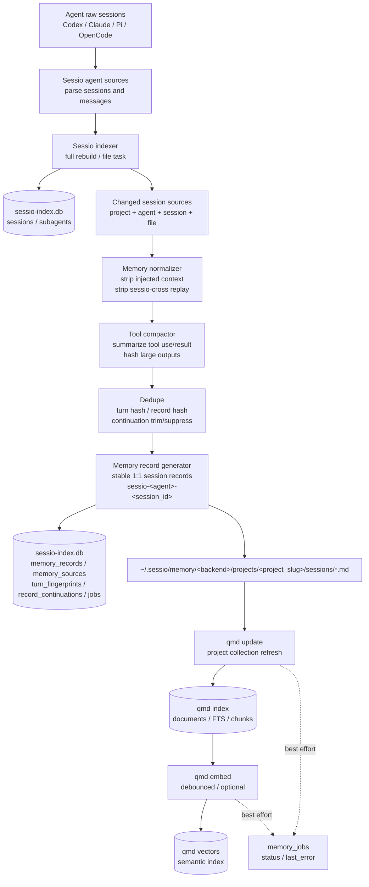
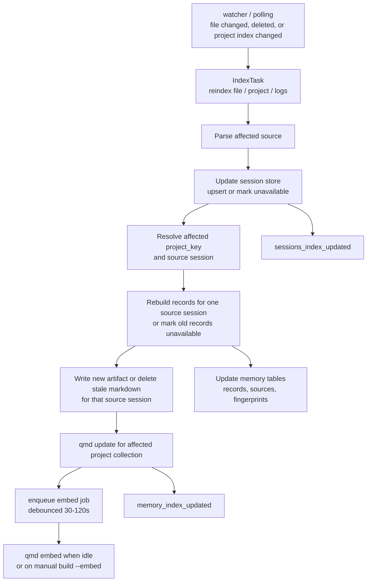
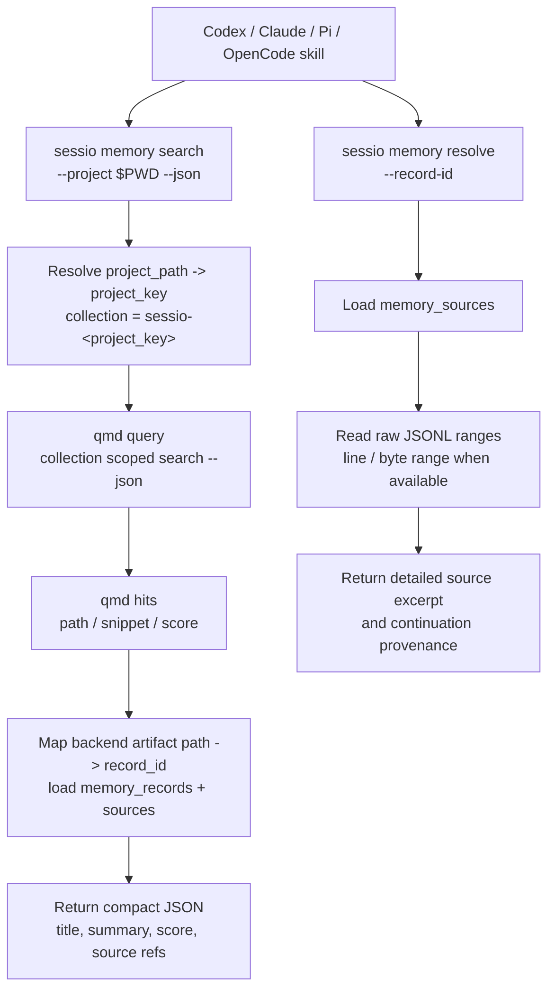

# Sessio CLI 与 qmd 项目记忆方案

## Summary

Sessio 下一阶段目标是把桌面应用背后的会话索引、消息提取、项目记忆和检索能力 CLI 化，让 Codex、Claude、Pi、OpenCode 等 agent 可以通过 skill 调用 Sessio，检索当前 project 的历史 session 信息。

核心设计：

- Sessio 继续作为 agent session 的统一解析层和事实源索引层
- qmd 只作为项目级压缩记忆的检索后端，不直接保存完整 JSONL
- CLI 提供稳定 JSON API，skill 只调用 CLI，不直接理解 qmd 或各 agent JSONL 格式
- build index 全量重建时同步生成 qmd 所需 memory 数据
- polling / watcher 增量更新 session 时同步更新对应 memory records 和 qmd 索引
- qmd 命中后返回 memory record，详情通过 Sessio 回源原始 JSONL

目标不是把所有对话原文塞进 qmd，而是生成小而准的 project memory records。qmd 负责“找到相关记忆”，Sessio 负责“维护来源、去重、压缩和回源详情”。

## Architecture

整体数据流：

```text
Codex / Claude / Pi / OpenCode sessions
  ↓
agents/sources
  ↓
indexer
  ├─ sessions / subagents metadata -> sessio-index.db
  └─ changed session events
       ↓
memory pipeline
  ├─ normalize messages
  ├─ strip sessio-cross replay blocks
  ├─ compact tool use / tool result
  ├─ dedupe turns and records
  ├─ trim/suppress continuation replay prefixes
  ├─ write project memory records
  └─ update qmd collection
       ↓
skill / CLI search
  ↓
qmd query
  ↓
Sessio resolves record source refs back to raw JSONL
```

推荐目录：

```text
~/.sessio/
  db-data/
    sessio-index.db
  memory/
    <backend>/
      projects/
        <project_slug>/
          sessions/
            <record_id>.md
          manifest.json
```

qmd 自己的 SQLite index 仍由 qmd 管理，可以使用 qmd 默认目录，也可以后续通过配置指定到 Sessio data dir。Sessio 不应直接写 qmd 内部表结构。

## Layering And Extensibility

为了后续添加新的 agent source，Sessio 应把 agents/sources、indexer、memory、qmd、CLI 做成清晰分层。除 source 层外，其他层不应该关心 Codex / Claude / Pi / OpenCode 的原始文件格式。

建议分层：

```text
agent source layer
  只负责识别和解析各 agent 的磁盘格式
  输出统一 SessionRecord / MessageEvent / SourceRef

indexer layer
  只处理统一数据结构
  负责 full rebuild、watcher/polling task、增量失效

store layer
  持久化统一 session metadata、source metadata、memory metadata

memory layer
  基于统一 MessageEvent 生成 records
  负责 cross prompt 去重、tool 压缩、turn/record dedupe

qmd backend layer
  只接收 record artifacts 和 project collection
  不理解 agent 格式

CLI / skill layer
  只暴露稳定 JSON API
  不暴露内部 source 差异
```

依赖方向必须单向：

```text
CLI/UI -> indexer/store/memory -> agents/sources
memory -> qmd backend
qmd backend 不反向依赖 agents/sources/store 之外的 agent 细节
```

### Agent Provider Interface

每个 agent source 应实现同一个 trait。新增 agent 时只需要实现 source 和 watch path 规则，不改 memory/qmd/CLI。

建议接口：

```rust
trait AgentSource: Send + Sync {
    fn agent(&self) -> AgentKind;
    fn display_name(&self) -> &'static str;

    fn roots(&self) -> Result<Vec<WatchRoot>>;
    fn discover(&self) -> Result<Vec<SessionSource>>;
    fn parse_source(&self, source: &SessionSource) -> Result<ParsedSession>;
    fn read_messages(&self, source: &SessionSource) -> Result<Vec<MessageEvent>>;

    fn classify_path_event(&self, event: &PathEvent) -> Option<SourceIndexTask>;
}
```

统一 task：

```rust
enum SourceIndexTask {
    ReindexSource(SessionSource),
    ReindexScope(SourceScope),
    MarkSourceUnavailable(SessionSource),
    RefreshProjectMappings,
}
```

统一 watch root：

```rust
struct WatchRoot {
    agent: AgentKind,
    path: PathBuf,
    recursive: bool,
    purpose: WatchPurpose,
}
```

这样 watcher/polling 只负责收集文件事件并询问 source 如何分类，不把具体 agent 的路径规则写死在上层。

### Unified Data Model

建议把现有 `Agent` 扩展为可注册的 `AgentKind`。第一版可以仍用 enum，后续如果要支持外部插件或动态 provider，再迁移到 string id。

```rust
#[derive(Debug, Clone, PartialEq, Eq, Hash, Serialize, Deserialize)]
struct AgentKind(String);

struct SessionSource {
    agent: AgentKind,
    session_id: String,
    scope: String,
    file_path: PathBuf,
    project: Option<ProjectRef>,
    source_kind: SourceKind,
}

struct ProjectRef {
    project_key: String,
    project_path: Option<PathBuf>,
    project_name: Option<String>,
}

enum SourceKind {
    MainSession,
    Subagent,
    ProjectIndex,
    Logs,
    Archive,
}
```

source 输出的 session 元数据：

```rust
struct SessionRecord {
    source: SessionSource,
    started_at: Option<i64>,
    updated_at: Option<i64>,
    message_count: usize,
    first_user_message: Option<String>,
    file_size: u64,
    file_mtime: Option<i64>,
    partial: bool,
    available: bool,
    archived: bool,
    children: Vec<SessionChildRecord>,
}
```

统一消息事件：

```rust
struct MessageEvent {
    source: SessionSource,
    event_id: Option<String>,
    turn_index: usize,
    role: MessageRole,
    content: MessageContent,
    timestamp: Option<i64>,
    location: SourceLocation,
}

enum MessageRole {
    User,
    Assistant,
    Thinking,
    System,
    ToolUse,
    ToolResult,
    Unknown(String),
}

enum MessageContent {
    Text(String),
    ToolUse(ToolUseEvent),
    ToolResult(ToolResultEvent),
    Mixed(Vec<MessageContentPart>),
}

struct SourceLocation {
    file_path: PathBuf,
    line_start: Option<u64>,
    line_end: Option<u64>,
    byte_start: Option<u64>,
    byte_end: Option<u64>,
}
```

memory pipeline 只接收 `MessageEvent`，因此新增 agent 的 tool 格式、消息格式都在 source 内部归一化。

### Store Interfaces

数据层应拆成三个逻辑 store，但可以先共用同一个 SQLite 文件和同一个 rusqlite connection。

```rust
trait SessionStore {
    fn init(&self) -> Result<()>;
    fn list_sessions(&self, filter: SessionFilter) -> Result<Vec<SessionRecord>>;
    fn list_sources(&self, filter: SourceFilter) -> Result<Vec<SessionSource>>;
    fn upsert_session(&self, record: &SessionRecord) -> Result<()>;
    fn replace_scope(&self, scope: &SourceScope, records: &[SessionRecord]) -> Result<()>;
    fn mark_source_unavailable(&self, source: &SessionSource) -> Result<()>;
}

trait MessageSourceStore {
    fn upsert_message_locations(&self, source: &SessionSource, events: &[MessageEvent]) -> Result<()>;
    fn resolve_source_range(&self, source: &SessionSource, range: SourceLocation) -> Result<RawExcerpt>;
}

trait MemoryStore {
    fn init(&self) -> Result<()>;
    fn replace_source_records(&self, source: &SessionSource, records: &[MemoryRecord]) -> Result<()>;
    fn mark_source_records_unavailable(&self, source: &SessionSource) -> Result<()>;
    fn list_project_records(&self, project_key: &str) -> Result<Vec<MemoryRecord>>;
    fn sources_for_record(&self, record_id: &str) -> Result<Vec<MemorySource>>;
}
```

`SessionStore` 负责列表和增量索引，`MessageSourceStore` 负责详情回源定位，`MemoryStore` 负责 record 和 backend artifact 映射。这样后续换 DB 或加远程同步时，不会影响 provider。

当前实现里，memory 相关结构化数据已经不止 record/source 两层，还包括：

- `turn_fingerprints`: continuation 候选召回和顺序比对材料
- `record_continuations`: 记录 continuation trim 的 base source、base coverage 范围，以及 candidate trim 起点

这意味着 continuation 的精确证据已经是 DB 一等数据，而不是只存在 markdown 文本里。

### Agent Source Registry

建议新增 registry，集中管理可用 provider：

```rust
struct AgentSourceRegistry {
    sources: Vec<Box<dyn AgentSource>>,
}

impl AgentSourceRegistry {
    fn discover_all(&self) -> Result<Vec<SessionSource>>;
    fn source_for_agent(&self, agent: &AgentKind) -> Option<&dyn AgentSource>;
    fn classify_path_event(&self, event: &PathEvent) -> Vec<SourceIndexTask>;
    fn watch_roots(&self) -> Result<Vec<WatchRoot>>;
}
```

当前内置 source：

```text
codex source
claude source
pi source
opencode source
```

未来新增 source 时：

1. 新增 `src-tauri/src/agents/sources/<agent>/parser.rs`
2. 实现 `AgentSource`
3. 注册到 `AgentSourceRegistry`
4. 增加 parser 测试和 sample fixtures
5. 不修改 memory/qmd/CLI 的核心逻辑

### Data Boundary Rules

必须保持以下边界：

- source 可以知道 agent 原始格式
- indexer 不可以解析 JSONL 内容，只调 source
- memory 不可以读取 agent 特有 JSON 字段，只处理 `MessageEvent`
- qmd backend 不可以读取原始 session 文件，只处理 record artifacts
- CLI 不可以暴露 agent 特有字段，除非放在 `metadata` map 中
- skill 不可以依赖 qmd 或 JSONL 格式，只依赖 CLI JSON

如需保留 agent 特有信息，统一放进 metadata：

```rust
type Metadata = BTreeMap<String, serde_json::Value>;
```

但核心流程不应依赖 metadata 中的字段。

## Data Flow Diagram

### Index And Memory Build



### Incremental Sync



### Search And Resolve



## CLI Goals

CLI 是给 skill 和其他 agent 用的稳定接口。第一版命令建议放在 Tauri crate 的 Rust binary 中，例如：

```text
src-tauri/src/bin/sessio.rs
```

CLI 复用现有 `app_lib::agents::sources`、`store`、`indexer` 模块。后续如果 GUI 和 CLI 共享逻辑变多，可以抽出 `core` 模块。

已实现命令：

```bash
sessio sessions list --project /path/to/project --json
sessio sessions messages --agent codex --session-id <id> --file-path <path> --json

sessio memory build --project /path/to/project --json
sessio memory search --project /path/to/project "query text" --json
sessio memory search --project-key <project_slug> "query text" --json
sessio memory resolve --record-id <record_id> --json
sessio memory jobs --project-key <project_slug> --json

sessio memory status --json
sessio memory sync --project-key <project_slug> --artifacts-root <path> --json
sessio memory sync --project-key <project_slug> --artifacts-root <path> --embed --json
```

Skill 主入口应该尽量简单：

```bash
sessio memory search --project "$PWD" "之前怎么设计 qmd 存储？" --json
```

返回示例：

```json
{
  "query": "之前怎么设计 qmd 存储？",
  "projectKey": "-Users-alex-Work-cloudgeek-sessio",
  "collection": "sessio--Users-alex-Work-cloudgeek-sessio",
  "backendError": null,
  "hits": [
    {
      "recordId": "sessio-codex-abc123",
      "title": "Project-level qmd memory design",
      "summary": "Use qmd for compressed project memory records while Sessio keeps raw JSONL source mappings.",
      "qmdPath": "-Users-alex-Work-cloudgeek-sessio/sessions/sessio-codex-abc123.md",
      "score": 0.82,
      "snippet": null,
      "continuation": {
        "coveredBy": "codex parent-session-id",
        "baseTurnRange": "turn 0..12",
        "candidateTrimStart": "turn 44, line 53, byte 340751"
      },
      "sources": [
        {
          "recordId": "sessio-codex-abc123",
          "agent": "codex",
          "sessionId": "abc123",
          "filePath": "/Users/alex/.codex/sessions/...",
          "location": {
            "filePath": "/Users/alex/.codex/sessions/...",
            "lineStart": null,
            "lineEnd": null,
            "byteStart": null,
            "byteEnd": null
          }
        }
      ]
    }
  ]
}
```

默认输出 **不** 包含 qmd 内部 payload。需要调试 qmd 返回结构时加 `--include-raw`，响应会多一个 `raw` 字段携带 qmd 原始 JSON。Skill 不应在正常工作流中使用该字段。

当 qmd 不可用、损坏或超时时，`memory search --json` 返回 `hits: []` 和非空 `backendError`。skill 应把这视为“本次没有可用 Sessio memory 命中”，不要猜测历史上下文。

当命中的 record 是 continuation trim 过的，当前 CLI 还会补一层适合人看的摘要：

- `memory search --json`: 每个 hit 可带 `continuation`
- `memory resolve --json`: 返回 `continuation` 和 `continuationSummary`

其中 `continuationSummary` 是给人直接看的压缩视图，包含：

- `coveredBy`
- `baseTurnRange`
- `baseLineRange`
- `baseByteRange`
- `candidateTrimStart`

## Skill Design

创建一个 Sessio skill，让其他 agent 用自然语言检索当前 project 的历史 session 数据。

Skill 职责：

- 判断当前工作目录对应的 project
- 调用 `sessio memory search --project "$PWD" <query> --json`
- 将命中的 record summary 和 source refs 提供给 agent
- 当 agent 需要详情时，再调用 `sessio memory resolve --record-id <record_id> --json`
- 不直接读取 JSONL
- 不直接调用 qmd
- 不直接解析 qmd 输出

Skill 说明里应强调：

- search 返回的是压缩记忆，不是完整事实
- resolve 才会读取原始 JSONL 片段
- 如果没有命中，agent 应该说明未找到历史记忆，而不是猜测

## Session Processing

### Normalization

Session 处理管线应复用现有 agents/sources，但需要比 UI 展示多保留来源定位信息。

建议新增内部结构：

```rust
struct RawTurn {
    agent: Agent,
    session_id: String,
    file_path: String,
    role: String,
    text: String,
    timestamp: Option<i64>,
    line_start: Option<u64>,
    line_end: Option<u64>,
    byte_start: Option<u64>,
    byte_end: Option<u64>,
}
```

**v1 status**: 来源定位采用混合粒度。Codex 和 Claude 的 `read_messages_with_locations` 会为每条消息记录 `line_start/line_end/byte_start/byte_end`；record 级 `memory_sources` 取所有 events 的并集 (min line_start ..= max line_end，byte 同理)。`memory resolve --include-source-excerpt` 会基于 location 把原始 JSONL 范围回读出来。

对于 continuation-trim 过的 record，`memory_sources.location` 记录的是 **保留后正文** 对应的原始范围，而不是整个 session 的起点。这和 `record_continuations` 一起，能把“record 现在展示的正文来自哪里”和“前缀是被哪条 base record 覆盖掉的”区分开。

### Cross Prompt 去重

Sessio 已经给 cross prompt 增加机器可读边界：

```md
<!-- sessio-cross:start source_agent="codex" source_session_id="..." source_file_path="..." -->

# Continued session from agent
The dialogue below is the recent context of an in-progress session ...

<!-- sessio-cross:end -->
```

memory pipeline 必须在索引前删除 `sessio-cross:start` 到 `sessio-cross:end` 之间的 replay block。这个 block 不是目标 session 的新信息，只是 continuation 上下文。

如果用户在同一条消息里追加了新需求，后续格式应尽量让新需求放在 end marker 之后。pipeline 只删除 marker 包住的部分，保留 end 之后的真实新需求。

同时记录 session 关系：

```sql
session_links(
  target_agent TEXT NOT NULL,
  target_session_id TEXT NOT NULL,
  source_agent TEXT,
  source_session_id TEXT,
  source_file_path TEXT,
  link_type TEXT NOT NULL,
  created_at INTEGER NOT NULL
)
```

### Tool Use / Tool Result

qmd memory 不应保存完整 tool output。建议规则：

- `tool_use`
  - 保留 tool name、command、cwd、关键参数
  - 提取涉及文件路径
  - 提取测试命令、构建命令、git 命令等重要动作
- `tool_result`
  - 保留 exit code、成功/失败状态
  - 保留错误摘要、关键测试名、关键文件行号
  - 保留输出 hash 和 source line range
  - 不保存完整 stdout / stderr
- 大输出
  - 生成 digest，例如 “cargo test failed: E0425 in src/foo.rs:42”
  - 详情通过 `memory resolve` 回源 JSONL

### Record Generation

不要一条 session 一个 Markdown，也不要一条 message 一个 Markdown。推荐：

当前实现是更保守的第一版：

```text
1 record = 1 session source
record_id = sessio-<agent>-<session_id>
project folder = <project_slug derived from canonical project path>
```

后续如果要把单 session 再细分成多个 task/decision records，可以在保持 source ref 抽象不变的前提下扩展。

record 内容应面向检索，包含：

- title
- summary
- decisions
- files touched
- commands / tests summary
- unresolved questions
- source refs
- keywords

当前实现有一个额外约束：为了避免 qmd 索引 continuation 的定位噪音，record markdown 不再写入 detailed continuation provenance。`Source:` 区块只保留当前 source ref；continuation 的详细 base/trim 范围只存在 `record_continuations` 和 CLI resolve/search 的摘要里。

示例：

```md
---
record_id: sessio-codex-abc123
project_key: -Users-alex-Work-cloudgeek-sessio
project_path: /Users/alex/Work/cloudgeek/sessio
agent: codex
session_id: abc123
source_jsonl: /Users/alex/.codex/sessions/...
line_start: 120
line_end: 186
kind: design
keywords:
  - qmd
  - project memory
  - session dedupe
---

# Project-level qmd memory design

Summary:
Use qmd as a project-level compressed memory search backend. Sessio remains responsible for session metadata, source mappings, dedupe, and resolving raw JSONL details.

Decisions:
- Do not store full JSONL content in qmd.
- Strip sessio-cross replay blocks before memory generation.
- Store compact tool summaries instead of full stdout/stderr.

Sources:
- codex abc123 lines 120-186
```

## Deduplication

qmd can help avoid exact duplicate document content, but Sessio must own real dedupe. Cross-agent continuation creates partial and near duplicates that qmd cannot reliably remove.

### v1 (implemented)

- record-level stable id: `sessio-<agent>-<session_id>` (1 record per session source)
- `memory_records.canonical_hash`: SHA-256 over normalized title/summary/body for change detection
- **turn content hash** (`turn_content_hash`): SHA-256 over `role + canonical_text(content)` **only**. Intentionally excludes agent / session_id / turn_index so two turns with the same normalized content collide across sessions (and across agents during cross-agent continuation). This is what gets stored in `turn_fingerprints.canonical_hash`.
- **turn source location** is preserved separately through the `turn_fingerprints` primary key `(project_key, agent, session_id, turn_index)` plus the `file_path / line_start / line_end / byte_start / byte_end` columns — these answer "where did this turn come from", not "what does it say".
- per-turn fingerprints are written during record build (`build_project_memory` and `build_source_memory`), and cleared (`replace_turn_fingerprints(..., &[])`) whenever a source no longer produces records
- continuation dedupe is active for same-project session sources and compares **ordered event sequences**, not just single hash collisions
- candidate recall still uses shared `turn_fingerprints.canonical_hash`, but final trim/suppress requires ordered prefix/suffix alignment plus low-information tail checks
- current directionality is intentionally conservative:
  - only same-agent candidates are compared
  - Codex with `forked_from_id` requires the candidate to be exactly that parent session (siblings never qualify, regardless of timestamps)
  - Sessions without `forked_from_id` fall back to earlier-session ordering via `started_at`, then `updated_at`, then `session_id`
- trim boundaries are snapped to the next `user` block start so the remaining record does not begin with dangling `tool_use` / `tool_result`
- when no user-block boundary exists after the matched prefix (i.e. the candidate has no fresh user turn of its own), the entire source is suppressed instead of generating a record — a continuation that only adds dangling tool work or assistant tail has no independent value
- detailed continuation provenance is persisted in `record_continuations` and exposed through `memory resolve` / `memory search`
- when a base session's `turn_fingerprints` get replaced (reindex), every `record_continuations` row pointing at that base is dropped and the dependent candidate records are marked unavailable so the next build pass regenerates them against the new base ranges
- stale records marked `available = 0` and their markdown removed when the source no longer produces them

### v2 (planned)

- tool result digest hash: hash command, exit code, key errors, output hash
- near-duplicate detection across records: SimHash / MinHash over record text; merge similar records by appending source refs instead of creating a new qmd record. `memory_records.simhash` column is reserved for this; v1 leaves it `NULL`.
- broaden continuation coverage only if needed later:
  - cross-agent continuation
  - multi-source joint coverage
  - fuzzier approximate matching across paraphrased turns

Suggested tables (v1 schema, v2 fields reserved):

```sql
memory_records(
  record_id TEXT PRIMARY KEY,
  project_key TEXT NOT NULL,
  canonical_hash TEXT NOT NULL,
  simhash TEXT,
  title TEXT NOT NULL,
  summary TEXT,
  available INTEGER NOT NULL DEFAULT 1,
  updated_at INTEGER NOT NULL
);

memory_sources(
  record_id TEXT NOT NULL,
  agent TEXT NOT NULL,
  session_id TEXT NOT NULL,
  file_path TEXT NOT NULL,
  line_start INTEGER,
  line_end INTEGER,
  byte_start INTEGER,
  byte_end INTEGER,
  PRIMARY KEY(record_id, agent, session_id, file_path, line_start, line_end)
);

turn_fingerprints(
  project_key TEXT NOT NULL,
  agent TEXT NOT NULL,
  session_id TEXT NOT NULL,
  turn_index INTEGER NOT NULL,
  role TEXT NOT NULL,
  canonical_hash TEXT NOT NULL,
  file_path TEXT NOT NULL,
  text_len INTEGER NOT NULL,
  line_start INTEGER,
  line_end INTEGER,
  byte_start INTEGER,
  byte_end INTEGER,
  PRIMARY KEY(project_key, agent, session_id, turn_index)
);

record_continuations(
  record_id TEXT PRIMARY KEY,
  project_key TEXT NOT NULL,
  candidate_agent TEXT NOT NULL,
  candidate_session_id TEXT NOT NULL,
  candidate_file_path TEXT NOT NULL,
  base_agent TEXT NOT NULL,
  base_session_id TEXT NOT NULL,
  base_file_path TEXT NOT NULL,
  base_start_turn_index INTEGER NOT NULL,
  base_start_line_start INTEGER,
  base_start_byte_start INTEGER,
  base_end_turn_index INTEGER NOT NULL,
  base_end_line_end INTEGER,
  base_end_byte_end INTEGER,
  candidate_trim_turn_start INTEGER NOT NULL,
  candidate_trim_line_start INTEGER,
  candidate_trim_byte_start INTEGER,
  updated_at INTEGER NOT NULL
);
```

## qmd Integration

qmd 作为外部检索后端接入。第一版不要把 qmd SDK 或 native dependencies 直接打包进 Tauri。

阶段建议：

1. 外部 qmd CLI
   - 检测 `qmd` 是否可用
   - 不可用时提示安装
   - Sessio 通过 CLI 调 `collection add`、`update`、`embed`、`query --json`
2. 托管 sidecar
   - Sessio 启动 qmd MCP / HTTP daemon
   - 减少查询冷启动成本
3. 内置分发
   - 打包 Node runtime、qmd、native sqlite/vector/llama 依赖
   - 最产品化，但跨平台成本最高

每个 project 推荐一个 qmd collection：

```bash
qmd --index sessio collection add ~/.sessio/memory/qmd/projects/<project_slug>/sessions \
  --name sessio-<project_slug> \
  --mask "**/*.md"

qmd --index sessio update
qmd --index sessio embed
qmd --index sessio search "query text" -c sessio-<project_slug> --json
```

Sessio 侧要维护：

- project path -> project slug
- project slug -> qmd collection name
- qmd binary path
- qmd index name or db path
- last qmd update/embed status
- last error

## Index Build And Polling Sync

这是实现时最重要的边界：**session index 更新和 qmd memory 数据更新必须在同一条索引流水线里触发**。

### Full Rebuild

`IndexTask::FullRebuild` 流程建议：

1. 扫描 Codex / Claude / Pi / OpenCode 原始 session 文件
2. 更新 `sessions` 和 `subagents`
3. 收集本次 rebuild 中所有受影响 project
4. 对每个 project 运行 memory rebuild
   - 重新扫描该 project 下的全部 session sources
   - 重新生成稳定 session records
   - 更新 `memory_records` / `memory_sources` / `turn_fingerprints`
   - 写入 `~/.sessio/memory/<backend>/projects/<project_slug>/sessions/*.md`
   - 对本次未再出现的旧 source records 标记 unavailable 并删除对应 markdown
5. 对每个受影响 project 调 qmd update
6. 按配置决定是否立即调 qmd embed
7. 发出 `sessions_index_updated` 和可选 `memory_index_updated`

首次实现可以把 qmd 同步作为 best-effort：session DB 写入成功是主路径，qmd 失败只记录错误，不回滚 session index。

### Incremental Watcher / Polling

当 watcher 或 polling 发现某个 session 文件变化：

1. 解析变化文件
2. 更新 `sessions` / `subagents`
3. 识别 affected project
4. 只重建该 session 对应的 memory records
   - 复用稳定 record id `sessio-<agent>-<session_id>`
   - 仅更新该 source 对应的 `memory_records` / `memory_sources`
   - 若该 session 不再能生成可用 memory，则把旧 record 标记 unavailable 并删除 markdown
5. 写新 Markdown record，或删除该 session 旧 Markdown record
6. 对 affected project 调 qmd update
   - 当前仍是 qmd index 级 `update`
   - 不是单 record 直写 qmd
7. 根据策略延迟 embed

Cold-start 注意：polling 进程内部用 in-memory HashMap 缓存 project index 文件的 mtime。每次 app 重启缓存都是空的，如果只看缓存就会在冷启动那一次 tick 把每个 project 都视为"index 文件变了"并触发 reindex 风暴。兜底策略是：cache miss 时把当前 mtime 跟该 scope 下 sessions 行的 `last_indexed_at` 最大值比较，只有当 index 文件比上次 reindex 完成时间更新才算真的变化。

建议不要每次小变更都同步跑 expensive embedding：

- `qmd update` 可以更频繁执行，但当前粒度仍是整个 index / collection 刷新
- `qmd embed` 做防抖批处理，例如 30-120 秒
- 用户主动 search 前，如果检测到 project 有 pending embeddings，可以先提示或后台补齐
- 可提供 `sessio memory build --embed` 手动强制生成向量

### Failure Handling

qmd 同步失败不能破坏 Sessio 主索引：

- session index 写入成功后立即可用
- memory record 写入失败记录到 `memory_jobs`
- qmd update/embed 失败记录 last_error
- 下一次 polling 或手动 `sessio memory update` 可重试

建议表：

```sql
memory_jobs(
  id INTEGER PRIMARY KEY AUTOINCREMENT,
  project_key TEXT NOT NULL,
  scope TEXT NOT NULL,
  kind TEXT NOT NULL,
  status TEXT NOT NULL,
  error TEXT,
  created_at INTEGER NOT NULL,
  updated_at INTEGER NOT NULL
);
```

## Public Rust Interfaces

建议新增模块：

```text
src-tauri/src/cli/
src-tauri/src/memory/
src-tauri/src/memory/records.rs
src-tauri/src/memory/dedupe.rs
src-tauri/src/memory/qmd.rs
src-tauri/src/memory/store.rs
src-tauri/src/bin/sessio.rs
```

建议内部接口：

```rust
trait MemoryStore {
    fn upsert_record(&self, record: &MemoryRecord) -> Result<()>;
    fn replace_record_sources(&self, record_id: &str, sources: &[MemorySource]) -> Result<()>;
    fn list_records_for_source(&self, agent: &str, session_id: &str, file_path: &str) -> Result<Vec<MemoryRecord>>;
    fn mark_record_unavailable(&self, record_id: &str) -> Result<()>;
    fn mark_source_records_unavailable(&self, agent: &str, session_id: &str, file_path: &str) -> Result<()>;
    fn list_project_records(&self, project_key: &str) -> Result<Vec<MemoryRecord>>;
}

trait QmdBackend {
    fn ensure_collection(&self, project: &ProjectRef) -> Result<()>;
    fn update_project(&self, project: &ProjectRef) -> Result<()>;
    fn embed_project(&self, project: &ProjectRef) -> Result<()>;
    fn search_project(&self, project: &ProjectRef, query: &str) -> Result<Vec<QmdHit>>;
}
```

Indexer 侧建议新增 hook：

```rust
trait MemoryIndexer {
    fn rebuild_all(&self) -> Result<()>;
    fn rebuild_project(&self, project: &ProjectRef) -> Result<()>;
    fn rebuild_session(&self, session: &SessionInfo) -> Result<()>;
    fn mark_source_unavailable(&self, file_path: &str) -> Result<()>;
}
```

## Implementation Phases

### Phase 1: CLI Read APIs

- 新增 `sessio` Rust binary
- 实现 `sessions list --json`
- 实现 `sessions messages --json`
- 输出稳定 JSON
- 为 skill 预留退出码和错误格式

### Phase 2: Memory Record Pipeline

- 新增 memory tables
- 从现有 agents/sources 生成 normalized turns
- 删除 `sessio-cross` replay block
- 压缩 tool use / tool result
- 生成 project memory records
- 写入 Markdown record artifacts
- 支持 `sessio memory build --project`

### Phase 3: qmd CLI Backend

- 检测 qmd binary
- ensure collection
- update project collection
- query project collection
- `sessio memory search --json`
- `sessio memory resolve --json`

### Phase 4: Indexer Integration

- `FullRebuild` 完成 session DB 更新后触发 memory rebuild
- watcher 增量任务完成后触发 session-level memory rebuild
- polling 检测到文件变化后同步更新 memory records
- qmd update 做 best-effort
- qmd embed 做防抖批处理

### Phase 5: Skill

- 创建 Sessio skill
- skill 调用 `sessio memory search`
- 需要详情时调用 `sessio memory resolve`
- 增加“未命中不要猜测”的指引

## Test Plan

### CLI

- `sessio sessions list --json` 输出合法 JSON
- `sessio sessions messages --json` 能读取 Codex / Claude / Pi / OpenCode
- project path 不存在时返回结构化错误
- qmd 不存在时 `sessio memory status --json` 返回可读错误
- qmd query 超时时 `sessio memory search --json` 返回空 hits 和 `backendError`

### Memory

- cross prompt marker 内的 replay block 不进入 record
- tool result 大输出被压缩为摘要和 hash
- continuation replay 前缀会被 trim，或者在尾部无有效新信息时整张 source 被 suppress
- continuation trim 会从下一个 `user` block 开始，不会留下没头没尾的 tool 事件
- 删除 session 文件后相关 records 被标记 unavailable

### qmd

- memory build 后 qmd collection 能创建
- qmd query 返回 record path / score / snippet
- `memory search` 能把 qmd hit 映射回 `record_id`
- `memory resolve` 返回 record metadata/body、source refs、continuation provenance；原始 JSONL 可按 location 回读 excerpt

### Indexer / Polling

- 全量 rebuild 后同步生成 qmd memory records
- 单个 Codex JSONL 更新后只重建对应 session record，并删除该 session 的 stale markdown
- Claude project 重扫后对应 project qmd collection 更新
- qmd update 失败不影响 session index
- qmd embed 防抖不会阻塞频繁 polling

## Open Questions

- 第一版是否先不做 LLM summary，只做规则压缩和 extractive records？
- qmd embedding 是否默认关闭，等用户显式启用后再下载模型？
- memory record 的 project key 当前已经改为 canonical project path 派生的可读 slug，而不是 hash 或 agent 自带 id。
- qmd collection 是每个 project 一个，还是一个 collection + metadata filter？当前建议每 project 一个 collection，便于 skill 限定搜索范围。

## Recommended Defaults

- 默认生成 memory records，但默认不自动下载 embedding 模型
- 默认 qmd update best-effort，不阻塞 session index
- 默认 `memory search` 使用 qmd BM25 / hybrid 可用能力
- 默认只保存压缩 record，不保存完整 tool output
- 默认删除 `sessio-cross` replay block
- 默认 skill 只调用 Sessio CLI，不直接调用 qmd
